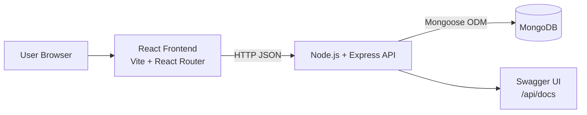

# System Architecture

## Overview

RecipeHub is a full-stack web application with a React SPA frontend, an Express REST API backend, and MongoDB for persistence.

## High-level architecture

## Backend layers

- Entry point: `backend/src/app.js`
- Configuration:
  - DB connection: `backend/src/config/db.js`
  - Swagger setup: `backend/src/config/swagger.js`
- Middleware:
  - Auth and role checks: `backend/src/middleware/auth.middleware.js`
- Domain models:
  - `User`, `Recipe`, `MealPlan`
- API route modules:
  - `auth.routes.js`
  - `recipe.routes.js`
  - `planner.routes.js`
  - `user.routes.js`

## Frontend layers

- App shell and routing: `frontend/src/App.jsx`
- Session/auth state: `frontend/src/context/AuthContext.jsx`
- API client/service modules: `frontend/src/api/*.js`
- Feature pages: `frontend/src/pages/*.jsx`
- Shared UI components: `frontend/src/components/`

## Security and access control

- JWT authentication for protected APIs
- Bearer token verification middleware (`protect`)
- Role-based authorization for admin endpoints (`adminOnly`)
- Protected routes on frontend for authenticated and admin-only pages

## Data flow summary

1. User authenticates with `/api/auth/login` and receives JWT.
2. Frontend stores token in local storage and sends it via Authorization header.
3. Backend validates token and attaches `req.user` for protected routes.
4. CRUD operations read/write MongoDB through Mongoose models.
5. UI updates state based on API responses.
